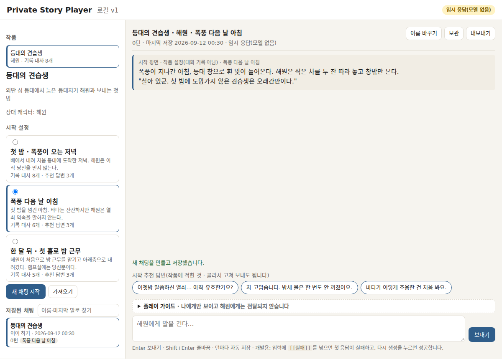
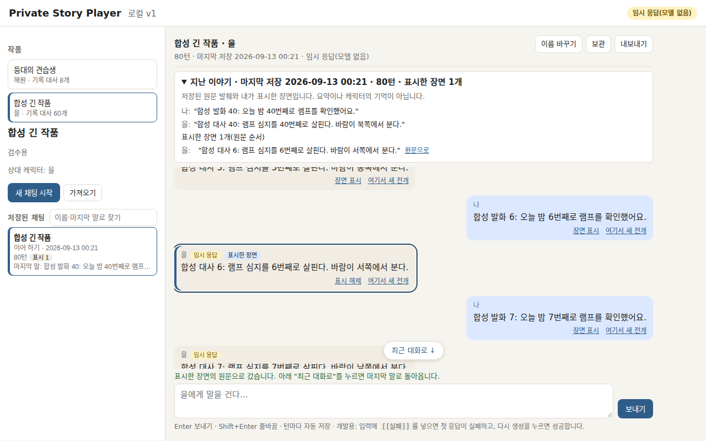

# Story Player (로컬 v1)

브라우저에서 한 작품의 캐릭터와 대화하며 이야기를 읽고, 턴마다 자동 저장되며, 닫았다가 다시 열어 이어 가고, 앞 장면에서 다른 전개로 갈라지고, 정해진 결말에 닿는 **개인 학습·포트폴리오용 인터랙티브 스토리 플레이어**입니다. Node 20 표준 라이브러리만으로 만든 로컬 서버 + 바닐라 JS 화면이며, 외부 서비스·계정·유료 API를 쓰지 않습니다.

이 저장소는 개발 저장소의 특정 시점(개발 커밋 f64622b)에서 **공개용으로 추린 사본**입니다. 개발 이력·내부 작업 기록·참고 서비스 화면 캡처·개인 채팅 파일은 넣지 않았습니다.

## 무엇을 실행하나

```bash
node --version        # >= 20
npm start             # http://127.0.0.1:3000 (loopback 전용)
```

브라우저에서 열면 샘플 작품 **『등대의 견습생』**이 보입니다. 시작 설정(세 가지 중 하나)을 고르고 '새 채팅 시작' → 추천 답변을 누르거나 직접 입력 → 캐릭터 해원의 대사가 옵니다. 턴마다 `data/chats/<id>.jsonl`에 저장되고, 브라우저를 닫았다 열면 '이어 하기'로 마지막 말부터 이어집니다.

기본 응답기는 **기록 응답기**입니다: 작품 파일에 시작별로 적힌 대사를 순서대로 돌려주고, 대사가 끝나면 그 시작의 엔딩 장면으로 이야기를 닫습니다. 언어 모델은 없습니다. (선택) OpenAI 호환 로컬 서버(예: llama.cpp `llama-server`)가 있다면 `RESPONDER=model MODEL_BASE_URL=http://127.0.0.1:8081 node server.js`로 모델 응답기를 쓸 수 있습니다 — 문맥 예산 사전 확인·초과 시 재시도·취소·시간 초과를 포함하며, 이 사본에서는 가짜 서버로 검사했으며 실제 모델은 실행하지 않았습니다(개발 중 실측 범위는 아래 한계 참고).

원고를 실제 플레이 순서(프롤로그 → 대사 → 엔딩)로 읽어 보려면:

```bash
npm run preview lighthouse-apprentice first-night
```

## 한 완성 장면

시작 설정 '첫 밤 · 폭풍이 오는 저녁'을 고르고 여덟 번 대화하면 아홉 번째 응답이 엔딩 **'열쇠를 받은 새벽'**입니다. 그 뒤 화면에는 끝 블록(총 턴·표시한 장면·다음 행동)이 붙고 입력창은 잠기며, 서버도 그 채팅에 새 턴을 거부합니다(409 `ENDED`). 다른 결말은 다른 시작 설정에 있습니다. 앞 장면의 '여기서 새 전개'를 누르면 그 턴까지를 복제한 새 채팅이 생겨 원본은 그대로 남습니다.

| 시작 설정 고르기 | 엔딩 | 긴 채팅에서 표시한 장면으로 갔다가 돌아오기 |
|---|---|---|
|  |  |  |

(모두 합성 채팅 화면입니다. 실제 사용자 채팅은 저장소에 없습니다.)

## 실제로 선택·교정한 이유 두 가지

1. **완결이 없던 문제 → 시작별 엔딩.** 대본이 끝나면 캐릭터 말풍선 안에 "(기록된 대사가 끝났습니다…)"가 매 턴 반복됐습니다. 구현 사정이 캐릭터의 말에 섞이고 이야기는 끝나지 않았습니다. 참고 서비스(크랙)의 '엔딩 설정'을 공개 자료로 대조한 뒤, 모델 없이 되는 규칙 — *그 시작의 대본이 끝나면 다음 응답이 엔딩 장면이고 거기서 끝난다* — 를 택했습니다. 엔딩은 저장 파일에서 `ending` 필드가 있는 마지막 캐릭터 턴으로 판정하므로 옛 채팅 파일과 호환됩니다.
2. **원고를 소비 순서로 읽고 고침.** ink 공식 실습의 "쓰고 바로 읽어 보기"를 참고해 `npm run preview`를 만들고 세 시작을 나란히 읽었더니, 한 시작의 대사가 "오늘 밤은 내가 마무리한다"로 엔딩 '혼자 지킨 밤'을 거짓으로 만들고 있었고, 다른 시작은 대사8과 엔딩이 같은 사건(열쇠 전달)을 두 번 끝냈습니다. 각각 대사 두 줄·한 줄만 바꿔 대사 수를 유지했습니다 — 이미 저장된 턴은 그대로이고, 진행 중인 채팅이 앞으로 받는 대사만 달라집니다. 회귀 검사가 그 문장을 고정합니다(`test/store.test.js` 끝 두 검사).

같은 방식으로 찾은 화면 결함의 예: 80턴 합성 채팅으로 "표시한 장면으로 갔다가 최근 대화로 돌아오기"를 따라가 보니 돌아오는 길이 없었고(16화면 수동 스크롤), 모바일에서는 다시 열면 마지막 말이 아니라 프롤로그가 보였습니다(창을 숨긴 채 그려 scrollHeight가 0). '최근 대화로' 버튼과 렌더 순서 수정, 그리고 마지막 말이 실제로 뷰포트에 있는지 확인하는 E2E(`test/e2e/long-chat.spec.js`)로 닫았습니다.

## AI와 함께 진행한 방식

사람이 작품을 읽고 저장·분기·이어 가는 목표와 우선순위, 모델 실행 비용과 공개 범위를 정했습니다. Claude Code가 설계·코드·검사·샘플 원고를 작성하고 화면을 검수했으며, Codex 총괄이 완료 보고를 실제 소비 경로와 대조해 교정할 지점을 전달했습니다.

대표 사례는 기능 검사에 더해 원고를 플레이 순서로 읽었을 때 드러난 열쇠 전달의 중복입니다. 코드가 동작하는지와 이야기가 자연스럽게 이어지는지를 서로 다른 질문으로 다뤘습니다. 실제 독자의 재미·만족이나 운영 성과는 이 합성 검수로 확인하지 않았습니다.

## 재현 명령과 확인 범위

```bash
npm test                  # 단위·통합 89개 (node:test, 설치 불필요)
npm ci && npm run browsers && npm run test:e2e   # Playwright E2E 30개 (Chromium headless shell 다운로드 필요)
```

이 사본을 만든 뒤 사본 안에서 `npm test`(89 통과)와 E2E(30 통과)를 실제로 돌렸습니다. E2E는 개발 환경에 이미 설치된 `node_modules`를 복사해 돌렸으므로, 새 환경에서는 `npm ci`와 브라우저 설치가 먼저 필요합니다. 검사는 모두 임시 디렉터리의 합성 채팅만 씁니다.

확인한 한계:
- 캐릭터 응답은 대본입니다. 사용자의 말에 따라 내용이 달라지지 않습니다(다만 시작 설정으로 시작·대사·엔딩이 달라집니다). 조건부 텍스트(독자가 본 것에 따라 문장이 갈리는 것)는 없습니다.
- 모델 응답기는 가짜 서버 검사와 개발 중 실제 로컬 모델 1회 실측(사용자 턴 1개)만 거쳤습니다. 대화 품질·기억 유지는 미검증입니다.
- 서버는 loopback(127.0.0.1)에만 열리고 인증이 없습니다. 공개 네트워크에 두는 용도가 아닙니다.
- 저장은 append-only JSONL이며 마지막 줄 손상은 견디지만 파일을 직접 편집한 경우의 모든 상황을 다루지는 않습니다(끊긴 턴 사슬은 화면에 알립니다).

## 저장 형식(한 채팅 = 한 파일)

`data/chats/<id>.jsonl`: 첫 줄 `meta`(작품·시작 설정·이름), 이어서 `turn`(id, role, text, parentId, 응답기 종류, 대사 번호, 엔딩 이름), `meta-update`(이름·보관), `mark`(표시한 장면). 분기는 앞 구간을 새 파일로 복제하고, 가져오기는 검증기(`lib/import.js`)를 통과한 파일만 새 채팅으로 들입니다.

## 참고한 것과 직접 만든 것

- **참고 서비스**(공개 자료만 관찰, 화면·콘텐츠 복제 없음): 크랙(시작 설정·엔딩 설정·요약 메모리의 공개 FAQ/이미지), Character.AI(공식 블로그), SillyTavern(공식 문서의 파일 구조·분기 개념), ink 공식 웹 실습(쓰고 바로 읽어 보기, 조건부 콘텐츠). 이 사본에는 그 서비스들의 화면 캡처를 넣지 않았습니다.
- **직접 구현**: 이 저장소의 모든 코드(서버·저장·응답기·화면·검사·미리보기 스크립트)와 샘플 작품 『등대의 견습생』(이 프로젝트를 위해 새로 쓴 독자 콘텐츠, AI와 함께 작성). 외부 런타임 의존성은 없고, 개발 의존성은 `@playwright/test` 1.63.0 하나입니다(각자의 라이선스는 `npm ci` 후 `node_modules` 안에 있습니다).
- 이 저장소의 코드에는 별도 라이선스 파일을 두지 않았습니다. 사용 조건은 저장소 소유자에게 문의해 주세요.
