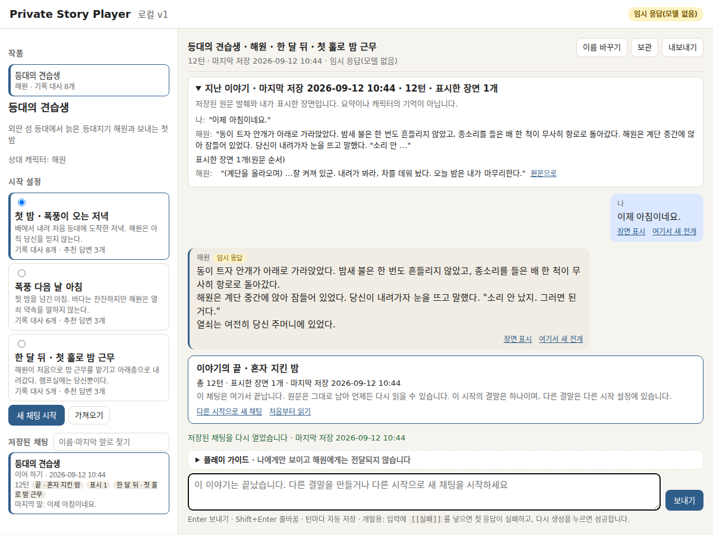

# Story Player

시작 설정을 골라 이야기를 읽고, 대화를 저장하고, 앞 장면에서 새 전개로 갈라지는 로컬 스토리 플레이어입니다.
샘플 작품 『등대의 견습생』으로 시작 선택 → 대화 → 엔딩 → 다시 열기를 체험할 수 있습니다.

## 주요 기능

- 세 가지 시작 설정과 시작별 엔딩
- 턴 자동 저장, 이어 읽기, 장면 표시와 분기
- 긴 대화에서 표시한 장면과 최근 대화 사이 이동
- 파일 가져오기와 원고 미리보기

기본 응답은 미리 작성한 대본입니다. 사용자의 자유 입력에 따라 이야기를 생성하는 모델은 기본 실행에 포함하지 않습니다.

## 로컬 실행

Node 20 이상이면 런타임 패키지 설치 없이 실행할 수 있습니다.

```bash
npm start   # http://127.0.0.1:3000
npm run preview lighthouse-apprentice first-night
```

'첫 밤 · 폭풍이 오는 저녁'을 선택하면 여덟 번 대화 후 아홉 번째 응답에서 엔딩에 도달합니다.
대화는 `data/chats/`에 저장됩니다. 서버는 loopback 전용이며 공개 서비스용 인증은 없습니다.



위 화면은 합성 채팅입니다. 개인 채팅은 저장소에 포함하지 않았습니다.

## 구현과 확인 범위

Node 표준 라이브러리와 바닐라 JavaScript로 만들었습니다. 기록·분기·완결을 한 흐름으로 연결하고,
기존 대화를 보존하면서 새 전개를 만들도록 구성했습니다. AI와 요구사항·구현·검증을 함께 진행한 학습 프로젝트입니다.

```bash
npm test
npm ci
npm run browsers
npm run test:e2e
```

공개 사본에서 단위·통합 89개와 브라우저 검사 30개를 확인했습니다. 실제 독자의 만족이나 장기 운영 품질은 평가하지 않았습니다.
선택적 모델 응답기 코드는 포함되어 있으나 이 사본에서 실제 모델을 실행하지 않았습니다.

## 참고와 사용 범위

크랙·Character.AI·SillyTavern·ink의 공개 자료를 기능 참고로 사용했습니다. 이 저장소의 화면과 샘플 작품은 새로 작성했으며 타사 캡처는 포함하지 않았습니다.
테스트 의존성은 Playwright입니다. 자체 코드에는 별도 공개 라이선스를 부여하지 않았습니다.
